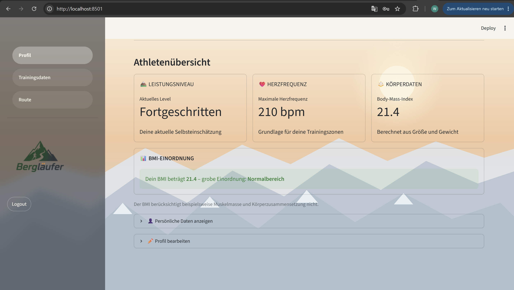
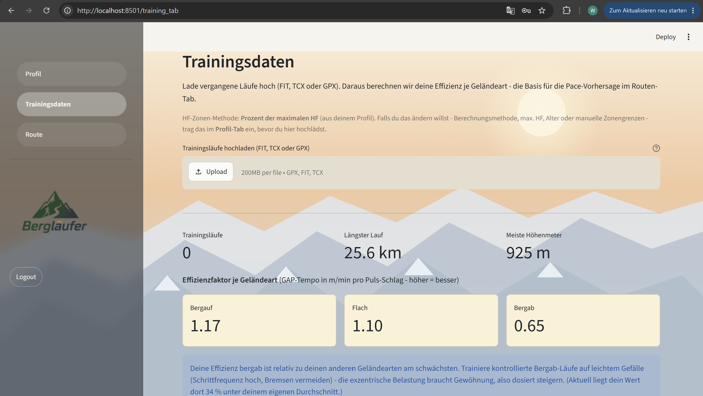
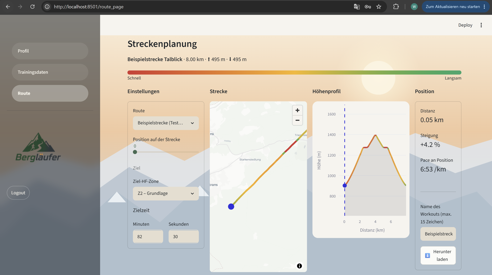

# 🏔️ Bergläufer Dashboard

Eine Streamlit-App für Berglauf-Training und Streckenplanung. Trainingsläufe (GPX/FIT) werden hochgeladen und nach Geländeart (bergauf/flach/bergab) und Herzfrequenz-Zone ausgewertet. Auf dieser Grundlage plant die App neue Strecken: GPX-Datei hochladen, Ziel-HF-Zone oder Zielzeit angeben, und die App zeigt Karte, Höhenprofil und Pace-Prognose pro Streckenabschnitt an — inklusive Export als Garmin-FIT-Workout.


## Tabs

- # Profil 
– Zugangsdaten, persönliche Daten, BMI-Auswertung, Bearbeiten des eigenen Profils



- # Trainingsdaten 
– GPX/FIT-Läufe hochladen, Effizienz je Geländeart und HF-Zonen-Methode auswerten



- # Route 
– Strecke planen: GPX hochladen oder Beispielstrecke nutzen, Ziel-HF-Zone/Zielzeit festlegen, Karte + Höhenprofil ansehen, als FIT-Workout exportieren



## Installation und Start

Voraussetzungen: **uv** und **Git** müssen installiert sein. Im Terminal vom Ordner, wo das Projekt abgelegt werden soll:

```bash
# Repository klonen
git clone https://github.com/Wenzelelele/Abschlussprojekt_programmieren_2.git

# In den Projektordner wechseln
cd Abschlussprojekt_programmieren_2

# Abhängigkeiten installieren
uv sync

# App starten
uv run streamlit run main.py
```

Die App öffnet sich automatisch im Browser.

## Team

Hannes Heimbach, Jannis Hammerer, Wenzel Lutter
